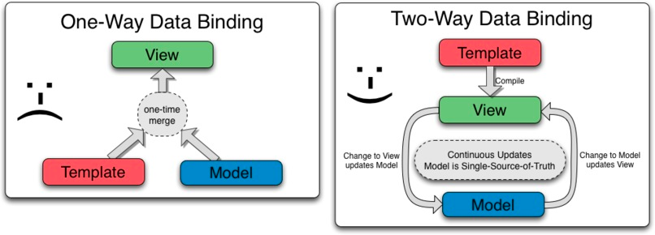

# 단방향, 양방향 데이터 바인딩

### 데이터 바인딩이란?
- 두 데이터 혹은 정보의 소스를 일치시키는 기법으로, 뷰와 메모리에 있는 데이터 모델을 일치시키는 것을 말합니다.
- 데이터 바인딩은 앱 UI와 해당 UI가 표시하는 데이터를 연결하는 프로세스입니다.

### 데이터 바인딩은 대표적으로 두가지 경우로 나눠서 구분을 짓습니다.
- 단방향 데이터 바인딩(One-Way Data Binding)
    - 소스 속성이 변경될 경우 대상 속성이 자동으로 업데이트되지만, 대상 속성이 변경될 경우 변경 내용이 다시 소스 속성으로 전파되지 않습니다.
    - 적절한 Event를 통해 데이터 흐름이 단방향으로 이루어집니다(부모 -> 자식)
    - 데이터와 템플릿을 결합하여 화면을 생성합니다.
    - 뷰가 바로 업데이트 되지 않습니다.
    - 유저 입력에 따라 데이터를 갱신하고 화면을 업데이트 해야 하므로, 데이터의 변화를 감지하고 화면을 업데이트 하는 코드를 매번 작성해주어야 합니다.
- 양방향 데이터 바인딩(Two-Way Data Binding)
    - 소스 속성 또는 대상 속성이 변경되어 다른 항목이 자동으로 업데이트됩니다.
    - 데이터 변경에 따라 양방향으로 이루어집니다(부모 <-> 자식)
    - 데이터의 변화를 감지해 템플릿과 결합하여 화면을 갱신하고 화면에서의 입력에 따라 데이터를 갱신합니다.
    - 뷰가 즉각 업데이트 됩니다.
    - 웹 애플리케이션의 복잡도가 증가할수록 빛을 발휘하는데 코드의 양을 줄여줄 뿐만 아니라 유지보수 측면에서 코드를 관리하기 매우 쉽게 해줄 수 있습니다.



## React
```typescript jsx
import React from 'react';

function Form(){
    const [state, setState] = useState<string>('');
    
    const onChange = (e: ChangeEvent<HTMLInputElement>) => {
        setState(e.target.value);
    }
    
    return(
        <form>
          <input type="text" value={state} onChange={onChange}/>
          {state}
        </form>
    )
}
```
React는 단방향 바인딩을 사용하는 javascript 라이브러리입니다.   
Javascript -> HTML 방향으로 데이터 바인딩이 가능하며, JSX 언어를 사용해 DOM을 생성하는 방식입니다.   
화면 요소에 데이터를 바인딩하기는 간편하지만 반대로 화면에서 데이터를 가지고 오는 방법은 상대적으로 복잡할 수 있습니다.

## Angular

```angular2html
<app-root></app-root>
```

```angularjs
import { Component } from '@angular/core';

@Component({
  selector: 'app-root',
  template: `<form>
              <input type="text" [value]="state"/> 
              {{state}}
             </form>`
        
})

export class AppComponent {
  state = 'value';
}
```
앵귤러 프레임워크는 데이터의 흐름에 따라 단방향 바인딩, 양방향 바인딩이 존재합니다.   
Angular는 DOM에 직접 접근하지 않고 템플릿과 컴포넌트 클래스의 상호 관계를 선언하는 방식(선언형 프로그래밍: Declarative programming)으로 뷰와 모델의 관계를 관리합니다.    
이를 통해 템플릿과 컴포넌트 클래스는 연결되고 데이터 바인딩은 템플릿 문법으로 기술합니다.

## Vue
```typescript
new Vue({ 
  el: "#app", 
  data: {
    state: "value"
  }
})
```

```html
<script src="https://cdn.jsdelivr.net/npm/vue"></script>
<form>
  <input type="text" v-model="state">
  {{state}}
</form>
```
Vue 또한 단방향 바인딩, 양방향 바인딩을 지원하며, v-model을 통해 양방향 데이터 바인딩을 지원합니다
HTML에 input 태그를 생성하고 v-model디렉티브를 설정합니다.  
data 객체 내에 state를 생성하고 v-model이 이 state를 참조하도록 설정해주었습니다.   
input 태그의 v-model 디렉티브를 통해 Vue의 data를 직접 수정할 수 있습니다.

## 결론
양방향 바인딩은 뷰와 메모리에 있는 데이터 모델을 일치시키는 것을 말합니다.   
UI 요소와 데이터를 프로그램적 방식으로 연결하지 않고, 선언적 형식으로 결합할 수 있게 도와준다고 생각하면 됩니다.   
React에서는 단방향, Angular, Vue에서는 양방향 바인딩을 제공합니다.   
상황마다 다르겠지만 평소 React를 자주 사용하는 저는 양방향바인딩을 잘 사용하지 않습니다.   
하지만 state를 관리할 때 뷰를 위한 데이터인지, API요청이나 데이터 가공을 위한 데이터인지 구분해서 사용하면   
관심사 분리나 유지보수 측면에서 용이할 수 있을 것 같습니다.
