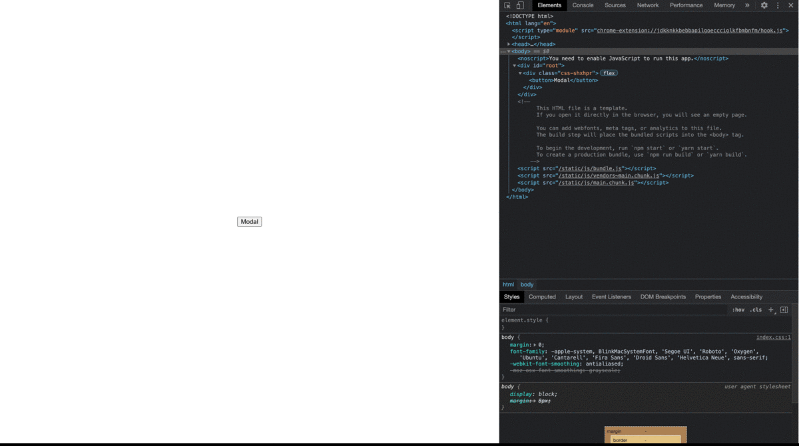

# React Portal

Portal은 부모 컴포넌트의 DOM 계층 구조 바깥에 있는 DOM 노드로 렌더링하는 방법을 제공합니다. 즉 리액트 프로젝트에서 컴포넌트를 렌더링하게 될 때, 컴포넌트를 어디에 렌더링 시킬지 DOM을 사전에 선택하여 부모 컴포넌트의 바깥에 렌더링 할 수 있게 해주는 기능입니다.

```jsx
ReactDOM.createPortal(children, container)
```

첫 번째 인자(child): 엘리먼트, 문자열, 혹은 fragment와 같은 어떤 종류이든 렌더링할 수 있는 React 컴포넌트   
두 번째 인자(container): DOM 엘리먼트

Portal을 사용하면 DOM의 계층구조 시스템에 의존하지 않고 컴포넌트를 렌더링 할 수 있습니다.   
대표적인 예로 모달이나 팝업은 부모 컴포넌트의 CSS에 의존해 번거로운 후처리를 해줘야합니다.   
이러한 상황에서 Portal을 사용하면 부모 컴포넌트 외부에 렌더링 할 수 있기 때문에 CSS를 비교적 손쉽게 관리 할 수 있습니다.   
먼저 간단하게 모달을 작성해보겠습니다.

Modal.tsx
```tsx
import { ReactNode, PropsWithChildren } from "react";
import styled from "@emotion/styled";

interface Props {
  show: boolean;
  onClose: () => void;
}

export const Modal = ({ show, children, onClose }: PropsWithChildren<Props>) => {
  if (!show) {
    return null;
  }
  return <BackDrop onClick={onClose}>{children}</BackDrop>;
};


const BackDrop = styled.div`
  width: 100vw;
  height: 100vh;
  position: fixed;
  top: 0;
  left: 0;
  background-color: rgba(0, 0, 0, 0.4);
  transition: opacity 0.2s;
  display: flex;
  align-items: center;
  justify-content: center;
  z-index: 100;
`;

```

ModalContent.tsx
```tsx
import { ReactNode } from "react";
import styled from "@emotion/styled";

interface Props {
  title: ReactNode;
  content: ReactNode;
}

export const ModalContent = ({ title, content }: Props) => (
  <Wrapper>
    <Header>{title}</Header>
    <Content>{content}</Content>
  </Wrapper>
);

const Wrapper = styled.div`
  min-width: 300px;
  min-height: 200px;
  border-radius: 10px;
  padding: 10px;
  background-color: #fff;
`;

const Header = styled.h1``;

const Content = styled.div`
  width: 100%;
  height: 100%;
`;

```

ModalContainer.tsx

```tsx
import { useState } from "react";
import { Modal, ModalContent } from "./component";

export const ModalContainer = () => {
  const [openModal, setOpenModal] = useState<boolean>(false);
  return (
    <>
      <button onClick={() => setOpenModal(true)}>
        Modal
      </button>
      <Modal
        show={openModal}
        onClose={() => setOpenModal(false)}
      >
        <ModalContent title="Modal" content="portal을 사용한 모달입니다." />
      </Modal>
    </>
  );
};

```

App.tsx

```tsx
import React from "react";
import styled from "@emotion/styled";
import { ModalContainer } from "./portal/modal-container";

const App = () => (
  <Wrap >
    <ModalContainer />
  </Wrap>
);

export default App;

const Wrap = styled.div`
  display: flex;
  align-items: center;
  justify-content: center;
  width: 100vw;
  height: 100vh;
  color: #61dafb;
`;

```


portal을 사용하지 않고 modal을 만들면 위와 같은 결과가 나타나게 됩니다.   
Modal 컴포넌트가 App컴포넌트 내부에 렌더링 되면서 App Component의 style을 그대로 상속받게 됩니다.   

이번엔 Portal을 이용해 원하는 곳에 DOM을 삽입해보겠습니다.

PortalWrap.tsx
```tsx
import { useMemo, useEffect, PropsWithChildren } from "react";
import { createPortal } from "react-dom";

export const PortalWrap = ({ children }: PropsWithChildren) => {
  const mountRoot= useMemo(() => document.createElement("div"), []);
  useEffect(() => {
    mountRoot.id = "portal-wrap";
    document.body.appendChild(mountRoot);
    return () => mountRoot.remove();
  }, [mountRoot]);
  return createPortal(<>{children}</>, mountRoot);
};

```

Modal.tsx

```tsx
import { PropsWithChildren } from "react";
import styled from "@emotion/styled";

import { PortalWrap } from "./portal-wrap";

interface Props {
  show: boolean;
  onClose: () => void;
}

export const Modal = ({ show, children, onClose }: PropsWithChildren<Props>) => {
  if (!show) {
    return null;
  }
  return (
    <PortalWrap>
      <BackDrop onClick={onClose}>{children}</BackDrop>
    </PortalWrap>
  );
};

const BackDrop = styled.div`
  width: 100vw;
  height: 100vh;
  position: fixed;
  top: 0;
  left: 0;
  background-color: rgba(0, 0, 0, 0.4);
  transition: opacity 0.2s;
  display: flex;
  align-items: center;
  justify-content: center;
`;

```


body태그 아래에 Modal이 렌더링 되면서 부모 컴포넌트의 style을 상속받지 않았고 z-index를 따로 관리하지 않아도 되게 되었습니다.   

## 이벤트 버블링
Portal은 DOM 트리의 어느 위치에나 있을 수 있으므로 이벤트 전파가 DOM 트리구조에 맞춰 발생하는 것처럼 오해할 수 있습니다.   
하지만 Portal의 이벤트는 DOM 트리와 무관하게 React 트리에서의 위치를 유지해 Portal을 사용하더라도 이벤트 버블링은 동일하게 작동합니다.   
즉, Portal에서 실행된 이벤트는 DOM 트리의 다른 위치에 있더라도 포함하는 React 트리의 조상으로 전파됩니다.

```tsx
import { PropsWithChildren, MouseEvent } from "react";

const Portal = () => React.DOM.createPortal(/* ... */)

const App = () => {
  // button에서 발생한 이벤트
  const handleClick = (e: MouseEvent) => {
    console.log(e) // button
  }
  return (
    <div className="App" onClick={handleClick}>
      App
      <Portal>
        <button>Button</button>
      </Portal>
    </div>
  )
}
```

## 정리
- Portal을 이용해 원하는 위치에 컴포넌트를 렌더링 할 수 있고 부모 컴포넌트의 스타일 속성으로부터 자유로워질 수 있습니다.
- 이벤트 버블링은 DOM 트리와 달리 React 트리 구조를 따르기 때문에 주의해야합니다.

#### 참조
- [ko.reactjs.org/docs/portals.html](https://ko.reactjs.org/docs/portals.html)