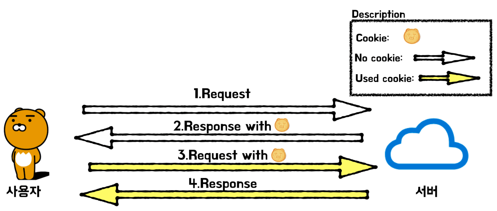

# 쿠키와 세션, 웹스토리지

설명하기에 앞서 왜 사용하는지쉽게 이해하기 위해 HTTP 프로토콜의 특징을 알아보자.

## HTTP 프로토콜의 특징, 쿠키와 세션을 사용하는 이유
- 비연결지향 (Connectionless): 클라이언트가 서버에게 Request를 보내고 서버가 클라이언트에게 Response를 보내면 접속을 종료한다.
- 무상태 (Stateless): 통신이 끝나면 상태 정보를 유지하지 않는다.
- 즉, 클라이언트의 로그인 정보나 브라우저에서 입력한 값 등이 페이지를 이동할 때 마다 초기화 되는 것입니다. 이러한 문제점을 해결하기 위해 데이터 저장에 사용하는 것이 쿠키, 세션 그리고 웹 스토리지.(쿠키와 세션을 통해 서버는 클라이언트에 대한 인증을 유지한다)
- ex) 쿠키와 세션을 사용하지 않으면 쇼핑몰에서 옷을 구매하려고 최초 로그인을 했음에도, 페이지를 이동할 때 마다 계속 로그인을 해야한다. 왜냐하면, 서버는 클라이언트가 누군지 기억하지 않기 때문

### 쿠키
- Client측(브라우저)에서 관리되는 key-value 형태의 작은 파일로 이름, 값, 만료 시간, 경로 정보를 가짐
- 사용자 인증에 유효한 시간 명시가능, 브라우저가 종료되도 인증이 유지된다.
- 클라이언트에 300개까지 쿠키저장 가능, 하나의 도메인당 20개의 값만 가질 수 있음, 하나의 쿠키값은 4KB 까지 저장.

-> 브라우저 종료시에도 남아있을 수 있다.

#### 쿠키 동작
1. 클라이언트가 페이지 요청
2. 서버에서 쿠키 생성
3. HTTP header에 쿠키를 포함 시켜 응답
4. 브라우저가 종료되어도 쿠키 만료 기간이 있다면 클라이언트에서 보관한다.
5. 쿠키가 존재하면 서버에 요청시 HTTP header에 쿠키를 포함시켜 요청(쿠키는 클라이언트가 따로 설정하지 않아도 브라우저가 HTTP header에 넣어서 서버로 전송하게 됩니다.)
6. 서버에서 쿠키를 읽어 이전 상태 정보를 변경 할 필요가 있으면, 쿠키를 업데이트하여 변경된 쿠키를 HTTP header에 포함시켜 응답

### 쿠키 사용
- "아이디와 비밀번호를 저장하시겠습니까?"
- 쇼핑몰의 장바구니
- 자동로그인, 팝업에서 "오늘 더 이상 이 창을 보지 않음" 체크



### 세션
- 사용자 정보 파일을 브라우저에 저장하는 쿠키와 달리 세션은 서버 측에서 관리한다.
- 서버에서 Client를 구분하기 위해 Session ID를 부여
- 웹 브라우저가 서버에 접속해서 브라우저가 종료될 때까지 인증상태 유지
- 사용자 정보를 서버에 저장하기 때문에 쿠키보다 보안에 좋다
- 사용자가 많아질수록 서버 메모리를 많이 차지하게 된다.

-> 브라우저가 종료되면 없어진다.

### 세션 동작
1. 클라이언트가 서버에 접속 시 Session ID 발급
2. 클라이언트는 Session Id에 대해 쿠키를 사용해서 저장
3. 클라이언트가 서버에 다시 접속시 이 쿠키를 이용해서 Session ID 값을 서버에 전달
```로그인과 같이 보안상 중요한 작업을 수행할 때 사용한다.```
   
## 쿠키와 세션의 차이점
- 사용자의 기록 정보가 저장되는 위치 : 쿠키-브라우저, 세션-서버
- 보안 : 세션이 서버에서 관리 되므로 더 좋다.
- 요청속도 : 쿠키가 빠르다. 세션은 서버에서 처리가 필요하기 때문이다.

## 세션스토리지와 로컬스토리지
