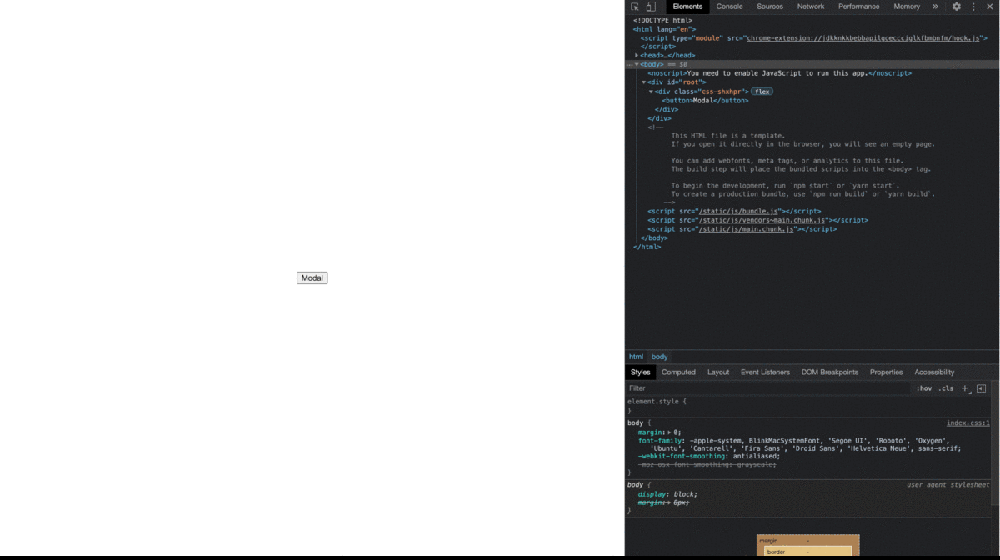

# React Portal

Portals는 부모 컴포넌트의 DOM 계층 구조 바깥에 있는 DOM 노드로 자식을 렌더링하는 방법을 제공합니다. 즉 리액트 프로젝트에서 컴포넌트를 렌더링하게 될 때, UI를 어디에 렌더링 시킬지 DOM을 사전에 선택하여 부모 컴포넌트의 바깥에 렌더링 할 수 있게 해주는 기능입니다.

```jsx
ReactDOM.createPortal(child, container)
```

첫 번째 인자(child)는 엘리먼트, 문자열, 혹은 fragment와 같은 어떤 종류이든[렌더링할 수 있는 React 자식](https://ko.reactjs.org/docs/react-component.html#render)입니다. 두 번째 인자(container)는 DOM 엘리먼트입니다

Portals 를 사용하면 DOM의 계층구조 시스템에 종속되지 않으면서 컴포넌트를 렌더링 할 수 있습니다. 리액트에서 모달이나 팝업과 같은 DOM요소에서 맨 앞으로 나와야하는 경우 Portal을 사용하면 부모 컴포넌트 바깥에 렌더링 할 수 있기 때문에 z-index나 event, style 등을  쉽게 관리 할 수 있습니다. 먼저 간단하게 모달을 작성해보겠습니다.

Modal.tsx

```typescript jsx
import { ReactNode } from "react";
import styled from "@emotion/styled";

const BackDrop = styled.div`
  width: 100vw;
  height: 100vh;
  position: fixed;
  top: 0;
  left: 0;
  background-color: rgba(0, 0, 0, 0.4);
  transition: opacity 0.2s;
  display: flex;
  align-items: center;
  justify-content: center;
  z-index: 100;
`;

interface ModalProps {
  show: boolean;
  children: ReactNode;
  onClose: () => void;
}

export const Modal = ({ show, children, onClose }: ModalProps) => {
  if (!show) {
    return null;
  }
  return <BackDrop onClick={onClose}>{children}</BackDrop>;
};

```

ModalContent.tsx

```typescript jsx
import { ReactNode } from "react";
import styled from "@emotion/styled";

const Wrapper = styled.div`
  min-width: 300px;
  min-height: 200px;
  border-radius: 10px;
  padding: 10px;
  background-color: #fff;
`;

const Header = styled.h1``;

const Content = styled.div`
  width: 100%;
  height: 100%;
`;

interface ModalContentProps {
  title: ReactNode;
  content: ReactNode;
}

export const ModalContent = ({ title, content }: ModalContentProps) => {
  return (
    <Wrapper>
      <Header>{title}</Header>
      <Content>{content}</Content>
    </Wrapper>
  );
};

```

ModalContainer.tsx

```typescript jsx
import { useState } from "react";
import { Modal, ModalContent } from "./component";

export const ModalContainer = () => {
  const [openModal, setOpenModal] = useState<boolean>(false);
  return (
    <>
      <button onClick={() => setOpenModal((openModal) => !openModal)}>
        Modal
      </button>
      <Modal
        show={openModal}
        onClose={() => setOpenModal((openModal) => !openModal)}
      >
        <ModalContent title="Modal" content="portal을 사용한 모달입니다." />
      </Modal>
    </>
  );
};

```

App.tsx

```typescript jsx
import React from "react";
import styled from "@emotion/styled";
import { ModalContainer } from "./portal/modal-container";

const AppWrapper = styled.div`
  display: flex;
  align-items: center;
  justify-content: center;
  width: 100vw;
  height: 100vh;
  color: #61dafb;
`;

function App() {
  return (
    <AppWrapper>
      <ModalContainer />
    </AppWrapper>
  );
}

export default App;

```


portal을 사용하지 않고 modal을 만들면 위와 같은 결과가 나타나게 됩니다. Modal 컴포넌트가 App컴포넌트 내부에 렌더링 되면서 App Component의 style을 그대로 받아옵니다. style뿐만이 아닌 이벤트를 사용하면 이벤트 버블링/캡쳐링이 되어 제대로 동작하지 않는 경우가 생길 수 있고, 프로젝트의 크기가 커질 수록 모든 상황에 대응하기엔 힘들 수 있습니다. 그래서 Portal을 이용해 원하는 곳에 DOM을 삽입해보겠습니다.

PortalWrap.tsx

```typescript jsx
import { useMemo, useEffect, ReactNode } from "react";

import { createPortal } from "react-dom";

interface PortalWrapProps {
  children: ReactNode;
}

export const PortalWrap = ({ children }: PortalWrapProps) => {
  // div tag 생성
  const subDiv = useMemo(() => document.createElement("div"), []);
  useEffect(() => {
    subDiv.id = "portal-wrap";
    document.body.appendChild(subDiv);
    return () => subDiv.remove();
  }, [subDiv]);
  return createPortal(<>{children}</>, subDiv);
};

```

Modal.tsx

```typescript jsx
import { ReactNode } from "react";
import styled from "@emotion/styled";

import { PortalWrap } from "./portal-wrap";

const BackDrop = styled.div`
  width: 100vw;
  height: 100vh;
  position: fixed;
  top: 0;
  left: 0;
  background-color: rgba(0, 0, 0, 0.4);
  transition: opacity 0.2s;
  display: flex;
  align-items: center;
  justify-content: center;
`;

interface ModalProps {
  show: boolean;
  children: ReactNode;
  onClose: () => void;
}

export const Modal = ({ show, children, onClose }: ModalProps) => {
  if (!show) {
    return null;
  }
  return (
    <PortalWrap>
      <BackDrop onClick={onClose}>{children}</BackDrop>
    </PortalWrap>
  );
};

```



body태그 아래 즉 App 컴포넌트 바깥에 Modal이 렌더링 되면서 Modal의 style을 유지할 수 있고 아래에 생성되어 따로 z-index를 관리하지 않아도 되는 이점이 있습니다. 프로젝트 상황마다 다르겠지만 모달이나 팝업창과 같이 유저 Action에 따라 새롭게 컴포넌트를 렌더링 해야하는 경우 유용하게 사용할 수 있을 것입니다.

\[참조\] [ko.reactjs.org/docs/portals.html](https://ko.reactjs.org/docs/portals.html)